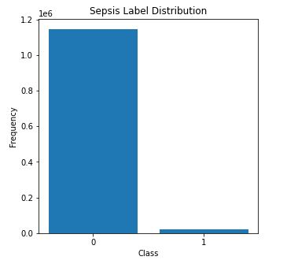
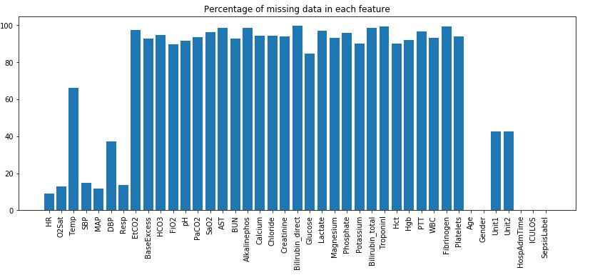

# Early Prediction of Sepsis from Clinical Data
Probabilistic Time Series dependent on the PhysioNet Computing in Cardiology Challenge 2019. [Link](https://physionet.org/content/challenge-2019/1.0.0/)

## Introduction
Sepsis is a life-threatening illness caused by your body’s response to an infection. Your immune system protects you from many illnesses and infections, but it’s also possible for it to go into overdrive in response to an infection. Sepsis develops when the chemicals the immune system releases into the bloodstream to fight an infection cause inflammation throughout the entire body instead. Severe cases of sepsis can lead to septic shock, which is a medical emergency. Around 30 millions individuals create sepsis and one-fifth of them die from the infection consistently around the globe. Distinguishing sepsis early and beginning quick treatment frequently spare patients lives.

## Project Objective
The objective of this project is to early detect sepsis (6 hours ahead) utilizing physiological information. The sources of info are patients' data, including imperative signs, research center qualities and demographics. The output is the results whether the model predicts non-Sepsis patients or Sepsis patients six hours in front of clinical beginning time.

## Dataset
For this study, we use clinical data of ICU patients from two separate hospital systems provided by the PhysioNet Computing in Cardiology Challenge 2019. The data for each patient are saved in a single pipe-delimited text file that has a fixed header. Each row of a patient file represents a single hour's worth for all the measurements within that ICU-hour stay. These measurements include vital signs, laboratory, and demographics values of 40 time-dependent variables. Nan indicates that the measurement is missing at this time interval. In total, we used over 40,336 patient files. After concatenating ICU-hour-stay entries from all the patients, we have about 1,552,229 lines of data in total.

According to the Challenge, labels in the dataset already take the goal of predicting Sepsis. The label for each hour of patient data is 1 (Sepsis onset positive) or 0 (Sepsis onset negative). Summarized from the labels, we have a very imbalanced dataset.

[Click here](https://archive.physionet.org/users/shared/challenge-2019/) to download the complete training database, consisting of two parts: training set A (20,336 subjects) and B (20,000 subjects).
## Data Preprocessing
#### Train-Validation-Test Split
First approach for solving early prediction of sepsis is to ignore the temporal component in the data. So each record can be treated as a single entity not dependent on any other record. This assumption might be flawed but for establishing a baseline, we are taking this assumption.<br/>

Train : 30K Patients Test : 5K Patients Validation : 5K Patients
#### Distribution of Dependent Variable
In the training dataset, we have a very imbalanced dataset. In label 0 we have about 1147309 lines of data and label 1 we have about 22556 lines of data.<br/>
<br/>
As we can see from the plot, it is a case of severe class imbalance . There are multiple methods that we could try to balance it (Over sampling or Undersampling) or even proceed without balancing but change the evaluation metric to average precision or roc_auc_sore.
#### Check For null in Features/ Independent variables
<br/>
We see that most of the columns have 90% + missing data. There are multiple ways of dealing with it. To establish a concrete baseline, I have decided to remove features with 90 % or more missing data.
## Baseline
The Features which are used for basleline. No Feature engineering has been done yet. We create the preprocessing pipelines for both numeric and categorical data.
```python
cont_scale_pipeline = make_pipeline(SimpleImputer(strategy = "median"), 
                                    StandardScaler())
cat_pipeline = make_pipeline(SimpleImputer(strategy = "constant", 
                                           fill_value = 999), 
                             OneHotEncoder(handle_unknown="ignore"))
preprocess_trans_scale = make_column_transformer((cont_scale_pipeline, 
                                                  ~categorical), 
                                                 (cat_pipeline, categorical))
```
Above code illustrates how to apply different preprocessing and feature extraction pipelines to different subsets of features, using column transformation. This is particularly handy for the case of datasets that contain heterogeneous data types, since we may want to scale the numeric features and one-hot encode the categorical ones.
In this code, the numeric data is standard-scaled after median-imputation, while the categorical data is one-hot encoded after imputing missing values with a new category ('999').
Finally, the preprocessing pipeline is integrated in a full prediction pipeline using sklearn.pipeline.Pipeline, together with a simple classification model.
